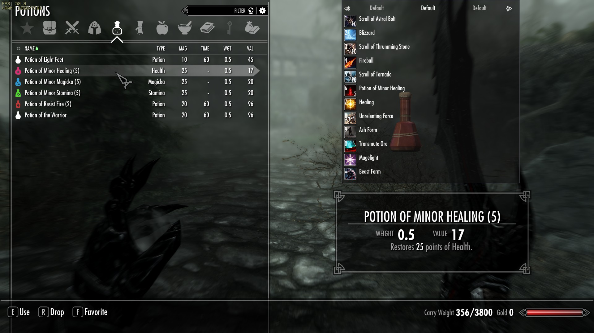

  
A total rework to SpellHotbar (https://github.com/pWn3d1337/Skyrim_SpellHotbar)

# Beta State
The mod is currently in a beta state and just being released to the public for testing. If you want to report Bugs create an Issue here, please also provide information about your skyrim binary version and include the log file in case of crashes or loading issues. ("C:/Users/USERNAME/Documents/My Games/Skyrim Special Edition/SKSE/SpellHotbar2.log"). Crash logs can also be helpful in case of a crash.

## Contribute
### Presets
If you want to help out you can create custom presets. I would like to add more presets to the installer.

### Video and Image material
If you have created cool Screenshots or video clips using the mods I could also use some promotion Material for the Mod Page in the future.

### Test the Mod and Report Issues
:-)

## Requirements
[SKSE](https://skse.silverlock.org/)  
[Address Library for SKSE Plugins](https://www.nexusmods.com/skyrimspecialedition/mods/32444)  
[SkyUI](https://www.nexusmods.com/skyrimspecialedition/mods/12604)  
[OAR](https://www.nexusmods.com/skyrimspecialedition/mods/92109)  
[Inventory Interface Information Injector](https://www.nexusmods.com/skyrimspecialedition/mods/85702) - if you want icons in the swf menu
[Custom Skill Framework v3](https://www.nexusmods.com/skyrimspecialedition/mods/41780) - when using custom perk tree

Opposed to v1 DAR is no longer supported as OAR is a superior alternative in any way and has an easier file structure.  
All papyrus lib requirements have been dropped.

## Supported Skyrim Version
The mod is built with CommonLib-NG and was tested on 1.5.97, 1.6.640 and 1.6.1070. Other versions will not be officially supported.

# Updating from v1:
* Keep a backup of your save.  
* Do a clean save (save game without mod). Make sure to remove all Files from v1. Use [Resaver](https://www.nexusmods.com/skyrimspecialedition/mods/5031/) to remove unattached script fragments.  
* Make sure your Game still works.  
* Install V2 (Also check changed requirements, OAR is now needed)

# Changes to v1

## SKSE based
All spell casting is now triggered by SKSE plugin and not by papyrus. Casting is now strongly tied to animations. 

## FOMOD Installer
Spell Packs and Perk Overhauls can now be selected inside a FOMOD installer. Spell Packs auto check depending on your installed plugins.
You can also chose an "Auto Profile" that will be applied on new game or first install.
  

## Auto Profiles
If a file called "..Data\SKSE\Plugins\SpellHotbar\presets\auto_profile.json" is present in your install it will automatically load on new game or first init. This allows to redestribute the MCM config in mod packs. An auto profile can be chosen during the installer.

## Input improvements
Modifiers are no longer hardcoded to CTRL, SHIFT and ALT and up to 3 modifiers can now be freely configured. All controller buttons should also be supported.
Key inputs are instantly registered without papyrus delay.

## First Person and Concentration Spell support
First person and concentration spells are now handled

## Dual Casting
Spells now can be bound to either Hand or both hands (Indicated by R, L and D in the bind menu). To toggle the hand, just press the Keybind in the binding menu again.
No R,L or D text indicated 'Auto' mode, there a spell will chose the hand depending on equipped items and uses Dual Casting if enabled. Dual Casting can be toggled by a power that is automatically added to the player
or by holding Keybind modifier that can be defined in the MCM. A spell can only be set to dual cast (D) in the menu if the spell supports dual casting and the player has the corresponding perk. (During the fomod installer select your correct perk overhaul so the dual cast perks are configured correctly). For balancing and animation reasons Dual casting blocks movement. (Technically by capturing your movement inputs, so no scripts are going to break from it)

### FP, Concentration and Dual Casting in Youtube Preview:  

## Support for Potions, Food Items and Scrolls
Potions, Food items and scrolls are now also supported. Scrolls behave very similar as spells. Potions will be used as equipping them in inventory. (Mods like animated potions are compatible). Optionall a gcd for potions can be configured to avoid insane potion spam when not using and animated potion mod. Self brewed potions (Dynamic Forms) are also supported with generic icons (changing depending on potions value) and changing their color depending on the strongest effect.

  

## Bar positioning and Layout
Positioning is now scaled to your resolution (using display height) and the Bar can be set to an anchor point (bottom, left, top, left-top, ...). This allows presets to also be transfered between different aspect ratios. (A left side vertical bar will work similar on 16:9 and 21:9 for example. 
Also the bar can now be changed in Layout by changing row and column count, this allows fully vertical bars or boxes. It is also possible to create a circle.

  
  

## Input Modes
It is now possible to chose the input mode.
* Direct cast - Like in V1, spells are casted when pressing the skill, powers are equipped and used. (compared to v1 the old power is re-equipped afterwards).
* Equip Mode - Will equip a spell or power instead of casting it. By setting hand it can be chosen which hand it will be equipped.
* Oblivion Mode - Tries to recreate Oblivion style casting. Adds a 2nd bar to show the currently equipped Spell and Potion. (Power can also be displayed). There is an extra shortcut for casting the equipped spell like in 'Direct Cast' mode. The regular keybinds will change the current selected spell/power/potion

  

## Battlemage Perktree [Optional]
Requires [Custom Skill Framework v3](https://www.nexusmods.com/skyrimspecialedition/mods/41780) to access the perktree, alternatively there is an MCM option under 'Perks' to disable Perk requirements.
Uses regular perk points. Allows to get "Spell Procs" which turns the next casted spell into near-instant cast and 50% less mana cost. Spell Procs are visible as animated golden border around spells. And the spell learn sound is played on trigger.
At start only novice and apprentice spell can consume procs and there is a 10s (configurable in mcm) cooldown in gaining a new proc after consuming one.

### Available Perks:
Note: chances and timing is configurable in MCM
#### Triggers (starting perks, no perk requirement):
* Cast On Concentration: Casting a concentration spell for 6 seconds can trigger Novice or Apprentice spell procs. Requires a Magic Skill of at least 25.
* Cast On Block: Timed Blocking can trigger Novice or Apprentice spell procs. Requires 'Block' 25.
* Cast On Crit: Critical hits can trigger Novice or Apprentice spell procs. Requires 'One-Handed' or 'Two-Handed' or 'Archery' 25.
* Cast On Backstab: Sneak Attacks can trigger Novice or Apprentice spell procs. Requires 'Sneak' 25.
* Cast On Power Attack: Power Attack hits can trigger Novice or Apprentice spell procs. Requires 'One-Handed' or 'Two-Handed' 25.
#### Advanced Perks
* Expert Battlemage (Requires at least one trigger): Spell Procs can trigger Adept and Expert spells. Reduces Cooldown by 20%. Requires 'Alteration' 50.
* Master Battlemage (Requires Expert Battlemage): Spell Procs can trigger Master spells. Reduces Cooldown by 40%. Requires 'Alteration' 75.   (Note 40% reduction in total, not additive)
 
   

## Ingame Editor
In the MCM an editor for Spells and Potions can be opened to edit the spell data, this allows to set custom Icons and some other values like animation for the spell and is savegame specific (stored in SKSE co-save).

   

## Currently supported Spell/Perk mods with icons
[Abyss](https://www.nexusmods.com/skyrimspecialedition/mods/83329)  
[Abyssal Tides Magic](https://www.nexusmods.com/skyrimspecialedition/mods/97892)  
[Abyssal Wind Magic](https://www.nexusmods.com/skyrimspecialedition/mods/96352)  
[Ancient Blood Magic II](https://www.nexusmods.com/skyrimspecialedition/mods/115106)  
[Andromeda - Unique Standing Stones of Skyrim](https://www.nexusmods.com/skyrimspecialedition/mods/14910)  
[Apocalypse - Magic Of Skyrim](https://www.nexusmods.com/skyrimspecialedition/mods/1090)  
[Arclight](https://www.nexusmods.com/skyrimspecialedition/mods/90405)  
[Astral Magic 2](https://www.nexusmods.com/skyrimspecialedition/mods/69938)  
[Constellation Magic](https://www.nexusmods.com/skyrimspecialedition/mods/92104)  
[Dark Hierophant Magic](https://www.nexusmods.com/skyrimspecialedition/mods/108499)  
[Desecration](https://www.nexusmods.com/skyrimspecialedition/mods/90832)  
[Elemental Destruction Magic Redux](https://www.nexusmods.com/skyrimspecialedition/mods/37211)  
[Holy Templar Magic](https://www.nexusmods.com/skyrimspecialedition/mods/113360)  
[Miracles of Skyrim](https://www.nexusmods.com/skyrimspecialedition/mods/71708)  
[Mysticism - A Magic Overhaul](https://www.nexusmods.com/skyrimspecialedition/mods/27839)  
[Obscure Magic](https://www.nexusmods.com/skyrimspecialedition/mods/103805)  
[Odin - Skyrim Magic Overhaul](https://www.nexusmods.com/skyrimspecialedition/mods/46000)  
[Ordinator - Perks of Skyrim](https://www.nexusmods.com/skyrimspecialedition/mods/1137)  
[Path of Sorcery - Magic Perk Overhaul](https://www.nexusmods.com/skyrimspecialedition/mods/6660)  
[Sacrosanct - Vampires of Skyrim](https://www.nexusmods.com/skyrimspecialedition/mods/3928)  
[Sonic Magic](https://www.nexusmods.com/skyrimspecialedition/mods/76360)  
[SPERG - Skyrim Perk Enhancements and Rebalanced Gameplay SE](https://www.nexusmods.com/skyrimspecialedition/mods/14180)  
[Stellaris](https://www.nexusmods.com/skyrimspecialedition/mods/86833)  
[Storm Calling Magic 2](https://www.nexusmods.com/skyrimspecialedition/mods/89643)  
[Thunderchild - Epic Shouts and Immersion](https://www.nexusmods.com/skyrimspecialedition/mods/1460)  
[Triumvirate - Mage Archetypes](https://www.nexusmods.com/skyrimspecialedition/mods/39170)  
[Vulcano](https://www.nexusmods.com/skyrimspecialedition/mods/88689)  
[Winter Wonderland Magic](https://www.nexusmods.com/skyrimspecialedition/mods/93871)  
[The Witcher Signs](https://www.nexusmods.com/skyrimspecialedition/mods/90645)  

# Known Issues
* Some Perk mods change the costs of spells to health, this is currently not working when casting through the hotbar
* Casting while moving in sneak mode has animation issues (walking in regular speed while counting as sneaking)
